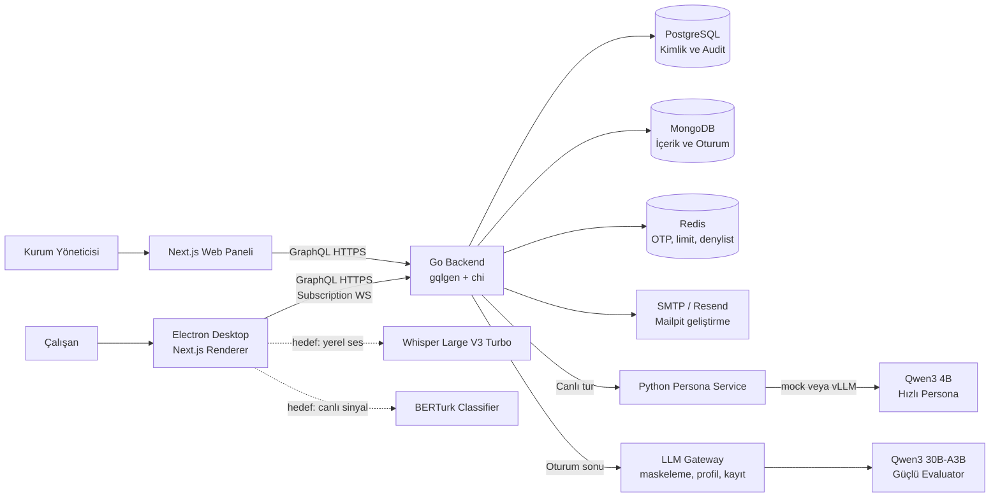
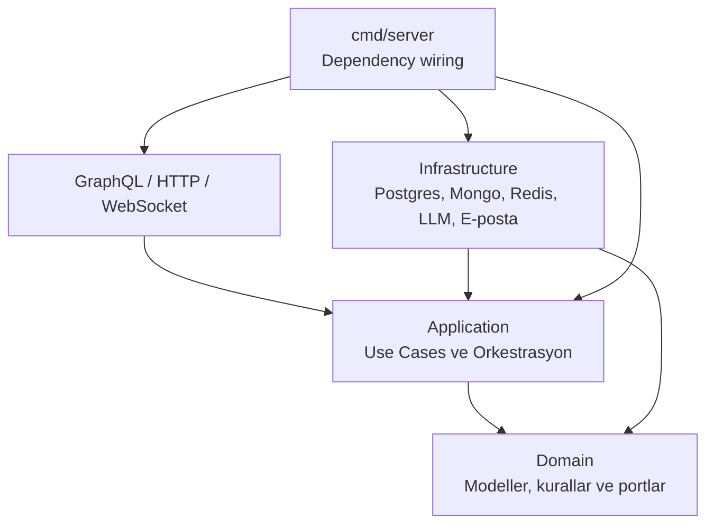
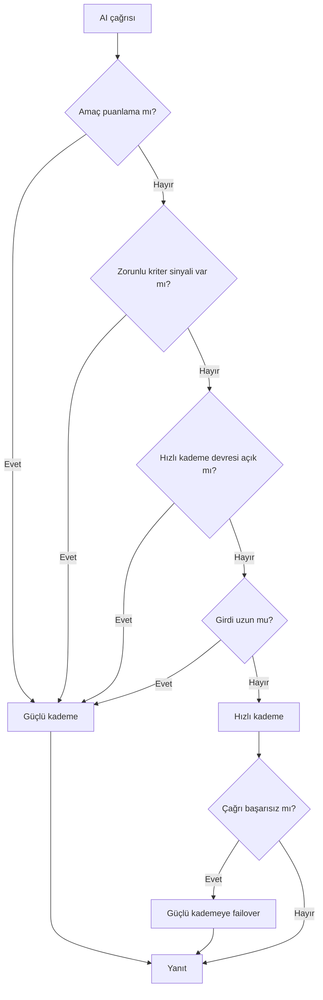
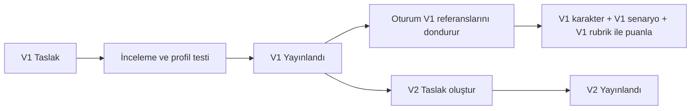
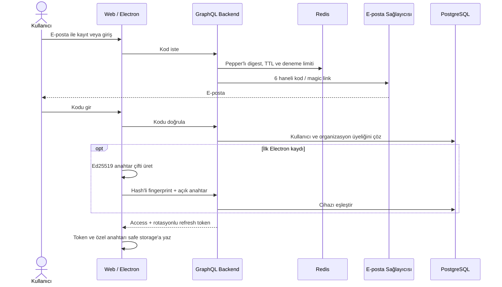
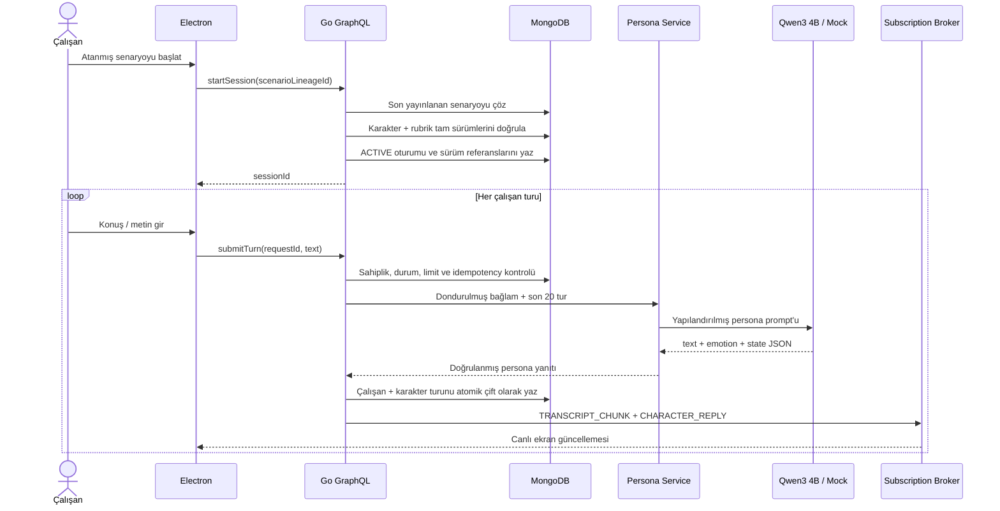
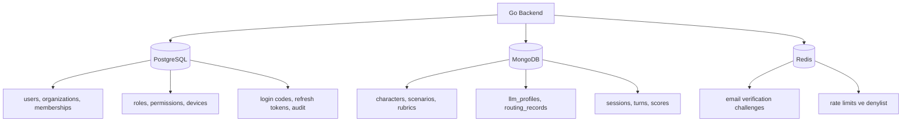

<p align="center">
  
</p>

# Prova

**Yapay zekâ destekli kurumsal iletişim eğitimi, rol yapma ve kanıta dayalı değerlendirme platformu.**

Prova; çalışanların yapay zekâ tarafından canlandırılan müşterilerle güvenli senaryolar oynamasını, görüşmelerin sürümlü rubriklerle değerlendirilmesini ve sonuçların transkriptten doğrulanabilir alıntılarla açıklanmasını hedefler. Platform; kurum yöneticisi için web paneli, çalışan için güvenli Electron masaüstü uygulaması, GraphQL tabanlı Go backend'i ve görevlerine göre ayrılmış yapay zekâ servislerinden oluşur.

> [!IMPORTANT]
> Bu belge, depodaki mevcut kodu ve hedef mimariyi birlikte anlatır. **Hazır**, **kısmi** ve **planlanan** bileşenler özellikle ayrılmıştır; aşağıdaki model isimleri kodda görülen varsayılan profillerdir, üretim sağlayıcısı ve model seçimi çalışma anında değiştirilebilir.

## İçindekiler

- [Proje özeti](#proje-özeti)
- [Mevcut durum](#mevcut-durum)
- [Sistem mimarisi](#sistem-mimarisi)
- [Yapay zekâ stratejisi ve model rolleri](#yapay-zekâ-stratejisi-ve-model-rolleri)
- [Uçtan uca sistem akışları](#uçtan-uca-sistem-akışları)
- [Veri mimarisi](#veri-mimarisi)
- [Güvenlik, KVKK ve denetlenebilirlik](#güvenlik-kvkk-ve-denetlenebilirlik)
- [Teknoloji yığını](#teknoloji-yığını)
- [Depo yapısı](#depo-yapısı)
- [Yerel kurulum](#yerel-kurulum)
- [Yapılandırma](#yapılandırma)
- [Test ve doğrulama](#test-ve-doğrulama)
- [Planlama ve yol haritası](#planlama-ve-yol-haritası)

## Proje özeti

### Çözülen problem

Klasik kurumsal eğitimler çoğunlukla pasif içerik tüketimine ve sonuç puanına dayanır. Prova bunun yerine çalışana gerçek bir görüşmeye benzeyen, tekrar oynanabilir bir ortam sunar:

1. Kurum yöneticisi karakter, senaryo ve değerlendirme rubriği hazırlar.
2. Çalışana uygun senaryo atanır.
3. Çalışan masaüstü uygulamasında yapay karakterle görüşür.
4. Görüşme sonunda ayrı bir değerlendirici model, yalnızca transkript ve rubriğe göre puan üretir.
5. Her kriterin gerekçesi transkriptten birebir alıntıyla desteklenir.
6. Zorunlu bir kriter ihlal edilmişse toplam puan yüksek olsa bile oturum başarısız sayılır.
7. Yönetici sonuçları, denetim kayıtlarını, model maliyetini ve gerekirse gerekçeli puan düzeltmesini yönetir.

### Temel tasarım ilkeleri

- **Tek model yerine görev ayrımı:** Canlı konuşmada hız, sertifikasyon puanında doğruluk önceliklidir.
- **Sürüm dondurma:** Bir oturum; oynadığı senaryo, karakter ve rubriğin tam sürümünü saklar.
- **Kanıtlı puan:** Model gerekçeleri transkript alıntılarıyla doğrulanır.
- **Yerel ses işleme hedefi:** Ham sesin backend'e gönderilmemesi planlanmıştır.
- **Sağlayıcı bağımsızlığı:** LLM profilleri model adı, base URL, örnekleme ve maliyet ayarlarını veri olarak tutar.
- **Kiracı izolasyonu:** Organizasyon kapsamı depo katmanına kadar taşınır.
- **Fail-closed güvenlik:** Üretimde eksik sır, güvensiz depolama veya kritik servis yokluğu sessizce geçilmez.

### Kullanıcı rolleri

| Rol | Ana yüzey | Sorumluluk |
|---|---|---|
| Çalışan / katılımcı | Electron masaüstü | Atanmış senaryoyu oynar, yerel mikrofon akışını kullanır, kendi oturumunu takip eder. |
| Kurum yöneticisi | Next.js web paneli | Persona, senaryo, rubrik, kullanıcı, cihaz, atama, sertifika ve denetim süreçlerini yönetir. |
| Sistem / ML yöneticisi | GraphQL + LLM profilleri | Model kademelerini, sağlayıcı uçlarını, maliyetleri ve prompt eklerini sürümler. |
| Denetçi | Web paneli / GraphQL | Skor kanıtlarını, override geçmişini, yönlendirme ve audit kayıtlarını inceler. |

## Mevcut durum

| Alan | Durum | Açıklama |
|---|---|---|
| Go backend ve GraphQL API | ✅ Hazır | IAM, oturum, sürümlü içerik, puan, audit, KVKK yaşam döngüsü ve subscription akışları uygulanmış durumda. |
| PostgreSQL / MongoDB / Redis / Mailpit geliştirme altyapısı | ✅ Hazır | Docker Compose ile çalışıyor. Kafka kodu korunuyor fakat varsayılan akışta kullanılmıyor. |
| Persona inference mikroservisi | ✅ Hazır | Python servisi mock veya OpenAI-compatible vLLM sağlayıcısıyla çalışıyor. |
| Oturum sonu güçlü değerlendirici | ✅ Hazır | OpenAI-compatible istemci, JSON çıktı, alıntı doğrulama ve zorunlu kriter kuralı uygulanmış durumda. |
| Web yönetim arayüzü | 🟡 Kısmi | Ekran ve akışların büyük kısmı hazır; hesap akışları ve bazı işlemler GraphQL'e bağlı, yönetim ekranlarının çoğu hâlen mock veri kullanıyor. |
| Electron güvenlik kabuğu ve kimlik akışı | ✅ Hazır | Onboarding, parolasız giriş, Ed25519 cihaz kimliği, güvenli depolama ve izin politikaları mevcut. |
| Electron canlı eğitim oturumu | 🟡 Kısmi | Bas-konuş, transkript ve rubrik UI'sı hazır; oturum şu anda senaryolu mock diyalog kullanıyor. |
| Whisper yerel STT | 🧭 Planlanan | `Whisper Large V3 Turbo + whisper.cpp` native binding/model paketlemesi tamamlanmayı bekliyor. |
| BERTurk davranış sınıflandırıcısı | 🟡 Model var, runtime planlı | 6.000 kayıtlık veri üretimi ve QLoRA adapter çalışması mevcut; ONNX/Electron canlı çıkarım entegrasyonu yok. |
| Çok örnekli gerçek zamanlı dağıtım | 🧭 Planlanan | Subscription broker süreç içi; yatay ölçek için Redis Pub/Sub benzeri dağıtık broker gerekiyor. |
| İmzalı masaüstü dağıtımı | 🟡 Kısmi | macOS/Windows/Linux paketleme CI'ı var; üretim sertifikaları, imzalama ve notarization ayrıca bağlanmalı. |

## Sistem mimarisi



### Bileşen sorumlulukları

| Bileşen | Sorumluluk | Kritik sınır |
|---|---|---|
| Web paneli | Kurum yönetimi, içerik, atama, sonuç, cihaz ve audit görünümü | Yönetim verilerinin çoğu için canlı GraphQL entegrasyonu tamamlanmalı. |
| Electron renderer | Çalışan deneyimi, bas-konuş, transkript, oturum ekranı | Node.js, dosya sistemi, token ve özel anahtar erişimi yoktur. |
| Electron main process | Güvenli depolama, cihaz anahtarı, imzalama, izin ve özel protokol | Renderer'a yalnızca dar `window.prova` köprüsü açılır. |
| Go backend | Yetkilendirme, iş kuralları, sürümleme, oturum, puan, audit ve API | Resolver'lar iş kuralı taşımaz; use-case katmanına delegasyon yapar. |
| Python persona servisi | Persona kontratı, prompt sınırları ve düşük gecikmeli model erişimi | Go katmanı sağlayıcı ayrıntılarını bilmez. |
| LLM Gateway | Güçlü kademe çağrısı, profil çözümü, PII maskeleme, maliyet ve routing kaydı | API anahtarı veritabanına değil ortam değişkenine konur. |
| PostgreSQL | Kullanıcı, organizasyon, rol, cihaz, token ve audit | “Bu kim ve neye yetkili?” sorusunu yanıtlar. |
| MongoDB | Sürümlü içerik, oturum, konuşma sıraları, skor ve routing kaydı | “Ne oynandı ve nasıl değerlendirildi?” sorusunu yanıtlar. |
| Redis | E-posta doğrulama, OTP durumu, rate limit ve denylist | Üretimde kimlik doğrulama güvenliği için zorunludur. |

### Backend katmanları

Backend hexagonal/clean architecture yaklaşımıyla ayrılmıştır:



- `domain`: framework'ten bağımsız iş kuralları ve portlar.
- `application`: oturum, içerik, IAM ve LLM orkestrasyonu.
- `infrastructure`: veri tabanları, sağlayıcı istemcileri, e-posta, GraphQL ve gerçek zaman adaptörleri.
- `cmd/server`: yapılandırmayı doğrular ve bütün bağımlılık grafiğini kurar.

## Yapay zekâ stratejisi ve model rolleri

### Model / görev matrisi

| Yapay zekâ / runtime | Sistemdeki rol | Çalıştığı bölüm | Neden bu rol? | Durum |
|---|---|---|---|---|
| `Qwen/Qwen3-4B-Instruct-2507` | Canlı persona, müşteri karakterinin kısa Türkçe yanıtını üretme | Python `persona_service`, OpenAI-compatible vLLM | Küçük model ve kısa JSON yanıt, canlı konuşma gecikmesini düşük tutar. | ✅ Entegre; vLLM veya mock ile çalışır |
| `Qwen/Qwen3-30B-A3B-Instruct-2507` | Oturum sonu rubrik değerlendiricisi | Go LLM Gateway üzerinden güçlü profil | Canlı yolun dışında daha yüksek doğruluk, uzun bağlam ve kriter bazlı gerekçe amaçlanır. | ✅ Backend'e entegre; endpoint ayrıca sağlanmalı |
| Whisper Large V3 Turbo + `whisper.cpp` | Sesi cihaz üzerinde metne çevirme | Electron masaüstü uygulaması | Ham sesin backend'e gitmemesi, düşük ağ bağımlılığı ve Türkçe STT kalitesi. | 🧭 Native entegrasyon planlı |
| `dbmdz/bert-base-turkish-cased` tabanlı BERTurk QLoRA | Canlı davranış sinyali sınıflandırması | Hedefte ONNX/Electron yerel runtime | Küçük, Türkçe ve multi-label sınıflandırmaya uygun; güçlü evaluator'ın yerine değil, canlı geri bildirim için. | 🟡 Dataset/adapter mevcut; runtime planlı |
| Python `MockPersonaProvider` | Persona akışını GPU'suz geliştirme ve test etme | `backend/ml/persona_service` | Tekrarlanabilir, deterministik geliştirme akışı sağlar. | ✅ Hazır |
| Go `cmd/mockllm` | OpenAI-compatible LLM çağrılarını uçtan uca test etme | Backend verify/smoke ve yerel geliştirme | Gerçek modele ücret/GPU bağımlılığı olmadan routing, puanlama ve profil testini doğrular. | ✅ Hazır |

> Qwen modelleri “koda sonsuza kadar sabitlenmiş seçimler” değildir. Seed sırasında varsayılan profil olarak gelir; yönetici `LLMProfile` sürümü oluşturarak model, sağlayıcı, base URL, temperature, top-p, token sınırı ve birim maliyeti değiştirebilir.

### Neden birden fazla model var?

Tek bir büyük model her işe bağlandığında canlı görüşme pahalı ve yavaş olur; tek bir küçük model her işe bağlandığında sertifikasyon puanının doğruluğu zayıflar. Prova bu iki hedefi ayırır:



Kural önceliği: `scoring` → `mandatory_signal` → `failover` → `long_input` → `default`. Her gateway kararı model, kademe, kural, gecikme, token, maliyet, başarı ve maskelenen alan sayısıyla MongoDB'ye yazılır.

Bu karar ağacı Go LLM Gateway'in mevcut yeteneğini gösterir. Güncel oturum kodunda puanlama ve profil testi Gateway'i kullanırken canlı persona çağrısı ayrı Python servisine gider. Bu nedenle `mandatory_signal`, `long_input` ve hızlıdan güçlüye `failover` kuralları, persona yolu Gateway ile birleştirilene kadar canlı turlarda devreye girmez.

### Güncel AI çağrı yolları

Depoda bugün iki ayrı inference yolu vardır:

1. **Canlı persona yolu:** Go backend → özel HTTP kontratı → Python persona servisi → mock/vLLM.
2. **Değerlendirme ve profil testi yolu:** Go backend → LLM Gateway → OpenAI-compatible sağlayıcı.

Bu ayrım önemlidir. Gateway'deki kademe yönlendirmesi, PII masker ve routing maliyet kaydı bugün değerlendirici/profil çağrılarında aktiftir. Canlı persona servisi yerel çalışmak üzere tasarlanmıştır ve şu anda aynı Gateway'den geçmez. Persona vLLM'i uzak bir sağlayıcıya taşınacaksa eşdeğer PII maskeleme ve çağrı telemetrisi Python servisine veya ortak giriş noktasına eklenmelidir.

### Canlı persona akışı

- Backend, senaryo kimliği yerine sunucu tarafında çözdüğü dondurulmuş karakter/senaryo içeriğini gönderir.
- En fazla son 20 konuşma sırası bağlama alınır.
- Persona ve senaryo alanları `UNTRUSTED_*` sınırları içinde referans veri olarak prompt'a eklenir.
- Model rolden çıkmaz, kendisini AI olarak tanıtmaz, rubriği veya doğru cevabı açıklamaz.
- Yanıt serbest metin değil; `text`, `emotion`, `conversation_state` alanlarını içeren doğrulanmış JSON'dur.
- Aynı `requestId`, tekrar gelen ağ isteklerinde konuşma sırasının iki kez yazılmasını engeller.

### Güçlü değerlendirici akışı

- Tam transkript, senaryo hedefi ve dondurulmuş rubrik güçlü profile gönderilir.
- JSON mode ile rubrikteki her kriter için puan, gerekçe, birebir alıntı ve `turn_index` istenir.
- Model kriter atlarsa kriter kaybolmaz; sıfır puanlı ve dayanaksız olarak eklenir.
- Modelin verdiği puan `[0, maxPoints]` aralığına sıkıştırılır.
- Alıntı, belirtilen çalışan konuşma sırasında gerçekten aranır ve `quoteVerified` olarak saklanır.
- Puanı üreten model kimliği ve rubrik sürümü skor belgesine yazılır.
- Yönetici override yaparsa eski toplam/sonuç ve gerekçe silinmez, ayrı kayıt olarak korunur.

### Puanlama kararı

Her kriter için ağırlıklı puan hesaplanır:

```text
toplam     = Σ (kriter puanı × kriter ağırlığı)
maksimum   = Σ (kriter maksimumu × kriter ağırlığı)
oran       = toplam / maksimum
başarılı   = oran ≥ geçme eşiği VE başarısız zorunlu kriter yok
```

Mevcut domain kuralında zorunlu bir kriter, maksimum puanın altında kaldığında `failedMandatoryKeys` listesine girer. Böylece örneğin kişisel veri koruması ihlali, diğer kriterlerden yüksek puan alınarak telafi edilemez.

### Prompt ve guardrail tasarımı

Persona ile evaluator aynı prompt'u kullanmaz:

- **Persona prompt'u:** karakterde kalma, AI olduğunu söylememe, doğru prosedürü öğretmeme, gerçek kişisel veri üretmeme ve hakaret üretmeme kuralları taşır.
- **Evaluator prompt'u:** yalnızca çalışanın davranışını puanlama, olmayan davranışı varsaymama, her kriter için birebir alıntı verme ve yalnızca JSON üretme kuralları taşır.
- **Yönetici eki:** LLM profilinde sürümlenir; sabit guardrail'in yerine geçmez.
- **Yapılandırılmamış metin:** persona, senaryo, geçmiş ve çalışan mesajı açık veri sınırları içinde modele sunulur.

### BERTurk veri ve kullanım planı

`backend/ml/generation` altında, 46 insan tarafından hazırlanmış seed kaydından deterministik olarak 6.000 Türkçe kayıt üreten araç bulunur. Bölünüm `4.800 train / 600 validation / 600 test` şeklindedir. Sınıflandırıcı şu sekiz davranış ailesini hedefler:

| Etiket | Davranış |
|---|---|
| `pii_disclosure` | Kişisel veri koruması / ihlali |
| `identity_verification` | Kimlik doğrulama davranışı |
| `greeting` | Karşılama ve tanıtım |
| `active_listening` | Etkin dinleme |
| `procedure_accuracy` | Prosedür doğruluğu |
| `empathy` | Empati ve ton |
| `solution_offer` | Uygulanabilir çözüm önerisi |
| `closing` | Görüşmeyi uygun kapatma |

Dataset kaynak adı `eminkutlu/prova-dataset`, QLoRA adapter kaynak adı `eminkutlu/prova-berturk-qlora` olarak belgelenmiştir. Büyük dataset ve checkpoint'ler Git deposuna eklenmez. Hedef runtime, modeli ONNX biçimine alıp Electron üzerinde her çalışan mesajı için düşük gecikmeli sinyal üretmektir; nihai sertifika puanı yine güçlü evaluator tarafından verilir.

## Uçtan uca sistem akışları

### 1. İçerik planlama ve yayınlama

Karakter, senaryo, rubrik ve LLM profili sürümlü belgelerdir. Yayınlanmış belge yerinde değiştirilmez:



Bu yapı, içerik sonradan değişse bile geçmiş bir sertifikanın hangi kurallarla verildiğini yeniden kurabilmeyi sağlar.

### 2. Kayıt, giriş ve cihaz güveni



Kayıtlı cihaz sonraki girişte sunucunun challenge metnini özel anahtarıyla imzalar. Özel anahtar renderer'a veya backend'e verilmez.

### 3. Canlı eğitim oturumu



Hedef masaüstü akışında “konuş / metin gir” adımından önce ses cihaz üzerinde Whisper ile metne çevrilir. Mevcut renderer henüz bu native akış yerine scriptli mock konuşma kullanır.

### 4. Oturumu bitirme ve puanlama

```mermaid
sequenceDiagram
    actor Employee as Çalışan
    participant API as Go Backend
    participant Mongo as MongoDB
    participant Gateway as LLM Gateway
    participant Eval as Güçlü Evaluator
    participant Verify as Quote Verifier
    participant WS as Subscription

    Employee->>API: endSession(sessionId)
    API->>Mongo: Durumu SCORING yap
    API->>WS: SCORING_PROGRESS 10
    API->>Mongo: Dondurulmuş rubrik + senaryo + transkript
    API->>Gateway: Purpose = scoring, JSON mode
    Gateway->>Gateway: Kullanıcı metninde PII maskele
    Gateway->>Eval: Güçlü profil ile değerlendir
    Eval-->>Gateway: Kriter bazlı JSON
    Gateway->>Mongo: Routing, token, maliyet ve gecikme kaydı
    Gateway-->>API: Model yanıtı
    API->>Verify: Puanları sınırla, eksikleri ekle, alıntıları doğrula
    API->>Mongo: Score + model + rubrik sürümü
    API->>Mongo: Oturumu COMPLETED yap
    API->>WS: SCORE_READY 100
```



Puanlama hata verirse oturum `SCORING` durumunda kilitli bırakılmaz; tekrar denenebilmesi için `ACTIVE` durumuna döndürülür.

### 5. Hesap silme ve anonimleştirme

1. Kullanıcı silme talebi oluşturur.
2. Hesap geri alınabilir `pending_deletion` durumuna geçer.
3. Bekleme penceresi dolunca zamanlanmış purge işi çalışır.
4. PostgreSQL'deki kişisel alanlar ve kimlik bilgileri silinir.
5. MongoDB oturumlarında kullanıcı bağı kaldırılır; çalışan metni `[silindi]` olur.
6. Skor ve audit, kişiye bağlanamayacak şekilde kurumsal kanıt olarak korunur.

## Veri mimarisi



### Veri sahipliği

| Veri | Kaynak | Saklama |
|---|---|---|
| Kullanıcı, organizasyon, rol, cihaz | PostgreSQL | Hesap ömrü; silmede kişisel alanlar temizlenir. |
| OTP / doğrulama challenge'ı | Redis veya ilgili uyumluluk yolu | Kısa TTL, tek kullanım ve deneme limiti. |
| Karakter, senaryo, rubrik, LLM profili | MongoDB | Sürümlü; yayınlanan sürüm değişmez. |
| Oturum ve transkript | MongoDB | Sertifikasyon kanıtı; hesap purge işleminde anonimleştirilir. |
| Skor ve override | MongoDB | Model/rubrik sürümü ve önceki değerlerle korunur. |
| Routing telemetrisi | MongoDB | Kademe, kural, model, token, maliyet ve gecikme. |
| Ham ses | Saklanmaz | Hedef mimaride cihaz üzerinde işlenir ve backend'e gönderilmez. |

### Gerçek zamanlı olaylar

GraphQL subscription hattı `graphql-transport-ws` kullanır. Oturum başına yayınlanabilen olaylar:

- `TRANSCRIPT_CHUNK`
- `RUBRIC_SIGNAL`
- `CHARACTER_REPLY`
- `SCORING_PROGRESS`
- `SCORE_READY`

Broker bugün tek Go süreci içindedir. Yavaş istemci ana oturum akışını bloklamasın diye abone başına tampon kullanılır; tampon dolarsa olay loglanarak düşürülebilir. Yatay ölçeklemede bu sözleşme dağıtık broker adaptörüyle korunmalıdır.

## Güvenlik, KVKK ve denetlenebilirlik

### Kimlik ve erişim

- Parola yoktur; kısa ömürlü e-posta kodu ve magic link kullanılır.
- Kodlar düz metin saklanmaz; e-posta/hesap bağı olan pepper'lı digest kullanılır.
- Access token kısa ömürlü, refresh token rotasyonludur; yeniden kullanım bütün aileyi iptal eder.
- `@auth` ve `@permission` GraphQL directive'leri alan seviyesinde koruma sağlar.
- Kiracı kapsamı JWT claim'inden çözülür ve veri deposu sorgularına zorunlu olarak taşınır.
- Kayıtlı Electron cihazı Ed25519 challenge imzasıyla doğrulanır.
- Üretimde GraphQL introspection/playground kapatılır; derinlik, karmaşıklık ve batch limitleri uygulanır.

### LLM güvenliği

- Persona içeriği ile kullanıcı mesajları güvenilmeyen veri sınırları içinde işlenir.
- Değerlendirme Gateway'i TC kimlik, TR IBAN, kredi kartı, telefon ve e-posta desenlerini yalnızca sağlayıcıya giden kopyada maskeler.
- TC kimlik ve kart desenlerinde checksum doğrulaması yanlış pozitifleri azaltır.
- Orijinal transkript, “çalışan kişisel veri ifşa etti mi?” kriteri ölçülebilsin diye yetkili veri alanında korunur.
- Modelin uydurduğu alıntı sessizce kabul edilmez; `quoteVerified=false` olarak işaretlenir.
- LLM API anahtarları MongoDB profiline veya audit metadata'sına yazılmaz.

### Audit kapsamı

Giriş talebi/başarısı/başarısızlığı, cihaz eşleştirme ve iptal, içerik sürümleme, LLM profil değişikliği/testi, oturum başlangıcı/bitişi, skor override, veri dışa aktarma ve hesap silme işlemleri denetlenebilir olaylar üretir. Serbest konuşma metni, OTP, token ve prompt eki audit kaydına yazılmaz.

Daha ayrıntılı tehdit modeli ve KVKK veri yaşam döngüsü için:

- [Backend güvenlik modeli](backend/docs/SECURITY.md)
- [KVKK veri envanteri ve silme davranışı](backend/docs/KVKK.md)
- [Gereksinim izlenebilirliği](backend/docs/TRACEABILITY.md)

## Teknoloji yığını

| Katman | Teknoloji |
|---|---|
| Backend | Go 1.26.4, chi, gqlgen |
| API | GraphQL query/mutation/subscription, `graphql-transport-ws` |
| Web | Next.js 16, React 19, TypeScript, Tailwind CSS, Apollo/GraphQL istemci altyapısı |
| Desktop | Electron 44, ayrı Next.js renderer, Electron Builder |
| Kimlik verisi | PostgreSQL 16 |
| İçerik ve oturum verisi | MongoDB 7 |
| Geçici güvenlik durumu | Redis 7 |
| E-posta | Resend veya SMTP; geliştirmede Mailpit |
| LLM serving | OpenAI-compatible HTTP ve vLLM |
| Gözlemlenebilirlik | Structured logging, Prometheus metrics, OpenTelemetry |
| Geliştirme / CI | Docker Compose, GitHub Actions, Go test, ESLint, Electron packaging |

## Depo yapısı

```text
Prova/
├── README.md                         # Bu doküman
├── start.sh                          # Full-stack yerel süreç yöneticisi
├── schema.graphql                    # İstemciler için üretilmiş SDL
├── backend/
│   ├── cmd/
│   │   ├── server/                   # Uygulama bootstrap ve dependency wiring
│   │   ├── seed/                     # Demo org, kullanıcı, içerik ve LLM profilleri
│   │   ├── mockllm/                  # OpenAI-compatible sahte sağlayıcı
│   │   ├── verify/                   # 12 gereksinim doğrulayıcısı
│   │   └── smoke/                    # Uçtan uca kullanıcı yolculuğu
│   ├── graph/                        # GraphQL şeması, resolver ve generated kod
│   ├── internal/
│   │   ├── domain/                   # İş modelleri ve kurallar
│   │   ├── application/              # Use-case ve orkestrasyon
│   │   ├── infrastructure/           # DB, LLM, e-posta, GraphQL adaptörleri
│   │   └── shared/                   # Config, middleware, telemetry, hata yapısı
│   ├── ml/
│   │   ├── generation/               # Türkçe behavioral dataset üretimi
│   │   └── persona_service/          # Python mock/vLLM persona servisi
│   ├── deployments/                  # Dockerfile ve geliştirme compose'u
│   └── docs/                         # Güvenlik, KVKK, traceability, WebSocket
└── frontend/
    ├── shared/                       # Ortak UI bileşenleri, stiller ve logolar
    ├── web/                          # Kurum yöneticisi Next.js paneli
    └── desktop/                      # Çalışan Electron + Next.js uygulaması
```

## Yerel kurulum

### Gereksinimler

- Docker Desktop veya Docker Engine + Compose
- Go `1.26.4`
- Node.js `22` ve npm
- Python `3.10+`
- Gerçek model çalıştırılacaksa uygun GPU ortamı ve vLLM

### 1. Ortam dosyasını hazırlayın

```bash
cp backend/.env.example backend/.env
```

En az `JWT_SECRET`, `AUTH_CODE_PEPPER` ve `EMAIL_VERIFICATION_OTP_PEPPER` için güçlü ve birbirinden farklı değerler üretin. `.env` Git tarafından izlenmez; gerçek sırları repoya eklemeyin.

### 2. GPU'suz tam mock geliştirme

Persona servisi ve evaluator farklı kontratlar kullandığı için iki test servisi açılır.

Terminal 1 — canlı persona mock'u:

```bash
python3 backend/ml/persona_service/server.py
```

Terminal 2 — OpenAI-compatible değerlendirici mock'u:

```bash
cd backend
go run ./cmd/mockllm -addr :8099
```

Terminal 3 — altyapı, backend, web ve desktop:

```bash
./start.sh
```

Terminal 4 — altyapı ayağa kalktıktan sonra demo verisini yazın ve LLM profillerini mock evaluator'a yönlendirin:

```bash
cd backend
go run ./cmd/seed
docker exec prova-mongo mongosh --quiet prova --eval \
  "db.llm_profiles.updateMany({}, {\$set: {base_url: 'http://localhost:8099/v1'}})"
```

Demo hesapları:

- Yönetici: `yonetici@prova.local`
- Çalışan: `calisan@prova.local`
- Geliştirme e-postaları: [http://localhost:8025](http://localhost:8025)

> [!NOTE]
> `start.sh` şu anda Python persona servisini veya seed komutunu kendisi başlatmaz. Persona servisini ayrı terminalde çalıştırmak ve ilk kurulumda seed atmak gerekir. Kafka varsayılan olarak kapalıdır; Kafka UI ile persona servisinin varsayılan portu `8090` çakışır. Kafka açılacaksa persona portunu ve `AI_SERVICE_URL` değerini birlikte değiştirin.

### 3. Gerçek Qwen modelleriyle çalışma

Hızlı persona modelini örneğin `8000` portunda sunun:

```bash
vllm serve Qwen/Qwen3-4B-Instruct-2507 --port 8000
```

Ayrı terminalde persona mikroservisini vLLM modunda açın:

```bash
AI_PERSONA_PROVIDER=vllm \
PERSONA_LLM_BASE_URL=http://localhost:8000/v1 \
python3 backend/ml/persona_service/server.py
```

Güçlü evaluator'ı ayrı bir endpoint'te sunun:

```bash
vllm serve Qwen/Qwen3-30B-A3B-Instruct-2507 --port 8001
```

Seed profilleri varsayılan olarak `http://localhost:8000/v1` ve `http://localhost:8001/v1` adreslerini kullanır. Uzak veya kimlik doğrulamalı OpenAI-compatible bir endpoint için `LLM_API_KEY` / `LLM_API_KEYS`, profil `baseUrl` ve `model` alanlarını güncelleyin. Persona servisi kendi `PERSONA_LLM_*` ayarlarını kullanır.

### 4. Yardımcı komutlar

```bash
./start.sh help       # tüm komutlar
./start.sh status     # çalışan uygulamalar ve container'lar
./start.sh logs       # backend, web ve desktop logları
./start.sh stop       # uygulamalar ve Docker servisleri
./start.sh clean      # volume ve yerel build çıktılarını temizler
```

`clean` komutu geliştirme veritabanı volume'larını da siler; kalıcı yerel veriniz varsa çalıştırmadan önce yedek alın.

### Yerel adresler

| Servis | Adres |
|---|---|
| Web paneli | [http://localhost:3000](http://localhost:3000) |
| Electron renderer | [http://127.0.0.1:3100](http://127.0.0.1:3100) |
| GraphQL | [http://127.0.0.1:8080/graphql](http://127.0.0.1:8080/graphql) |
| GraphQL Playground | [http://localhost:8080/playground](http://localhost:8080/playground) |
| Liveness | [http://localhost:8080/health/live](http://localhost:8080/health/live) |
| Readiness | [http://localhost:8080/health/ready](http://localhost:8080/health/ready) |
| Metrics | [http://localhost:8080/metrics](http://localhost:8080/metrics) |
| Mailpit | [http://localhost:8025](http://localhost:8025) |
| Persona health | [http://localhost:8090/health](http://localhost:8090/health) |

## Yapılandırma

Backend'in tam açıklamalı ana listesi [`backend/.env.example`](backend/.env.example) içindedir. Python persona sağlayıcısının ek ayarları [`backend/ml/README.md`](backend/ml/README.md) ve `persona_service/settings.py` içinde tanımlıdır. Ana gruplar:

| Grup | Önemli değişkenler |
|---|---|
| Uygulama | `APP_ENV`, `SERVER_HOST`, `SERVER_PORT`, `CORS_ALLOWED_ORIGINS` |
| Veritabanı | `DB_*`, `MONGO_URI`, `MONGO_DATABASE`, `REDIS_*` |
| Kimlik | `JWT_SECRET`, `AUTH_CODE_PEPPER`, `EMAIL_VERIFICATION_OTP_PEPPER`, token TTL'leri |
| Persona servisi | `AI_SERVICE_URL`, `AI_SERVICE_TIMEOUT_SECONDS` |
| Persona modeli | `AI_PERSONA_PROVIDER`, `PERSONA_LLM_BASE_URL`, `PERSONA_LLM_MODEL`, `PERSONA_*` |
| Evaluator / Gateway | `LLM_API_KEY`, `LLM_API_KEYS`, `LLM_FAST_BASE_URL`, `LLM_STRONG_BASE_URL` |
| E-posta | `EMAIL_PROVIDER`, `RESEND_*`, `SMTP_*`, `WEB_BASE_URL` |
| GraphQL korumaları | `GRAPHQL_MAX_DEPTH`, `GRAPHQL_MAX_COMPLEXITY`, `GRAPHQL_MAX_BATCH` |
| Hesap yaşam döngüsü | `LIFECYCLE_DELETION_GRACE_SECONDS`, purge ayarları |

Sağlayıcı/model/fiyat ayarları env ile profil arasında bilinçli olarak ayrılmıştır:

- **Env:** sırlar ve deployment'a özgü bağlantılar.
- **MongoDB LLM profili:** model, base URL, örnekleme, token limiti, prompt eki ve birim maliyet.
- **Routing kaydı:** o çağrıda fiilen kullanılan model, token, maliyet ve karar kuralı.

## GraphQL API özeti

Tek istemci API yüzeyi `/graphql` yoludur; REST yalnızca sağlık ve metrik uçları için kullanılır.

| Alan | Başlıca operasyonlar |
|---|---|
| Hesap | `register`, `requestEmailVerificationCode`, `verifyEmail`, `requestLoginCode`, `verifyLoginCode`, `refreshToken`, `logout` |
| Cihaz | `myDevices`, `requestDeviceChallenge`, `revokeDevice` |
| İçerik | `characters`, `scenarios`, `rubrics`, create/update/publish mutation'ları |
| Oturum | `startSession`, `submitTurn`, `endSession`, `mySessions`, `session` |
| Puan | `session.score`, `overrideScore` |
| AI yönetimi | `llmProfiles`, `createLLMProfile`, `updateLLMProfile`, `publishLLMProfile`, `testLLMProfile` |
| Gözlem | `routingStats`, `routingRecords`, `auditLog` |
| KVKK | `exportMyData`, `requestAccountDeletion`, `cancelAccountDeletion`, `deletionStatus` |
| Gerçek zaman | `sessionEvents` subscription |

Kaynak şema: [`backend/graph/schema.graphqls`](backend/graph/schema.graphqls). İstemci SDL çıktısı: [`schema.graphql`](schema.graphql).

## Test ve doğrulama

### Backend

```bash
cd backend
go build ./...
go vet ./...
go test ./...
./scripts/verify.sh
./scripts/smoke.sh
```

- `verify.sh`, belgelenmiş 12 sistem gereksinimini bağımsız PASS/FAIL kontrolleriyle doğrular.
- `smoke.sh`, kod istemeden hesap silmeye kadar tek kullanıcının uçtan uca yolculuğunu yürütür.
- Gerçek MongoDB bulunmayan bazı entegrasyon testleri kendini atlayabilir; `verify.sh` gerekli altyapıyı açar.

### ML araçları

```bash
PYTHONPATH=backend/ml python3 -m unittest discover \
  -s backend/ml/persona_service -p 'test_*.py'
python3 backend/ml/generation/generate_dataset.py
python3 backend/ml/validate_dataset.py
```

Generator; split sızıntısı, duplicate, evidence span, taxonomy ve kalite alanlarını doğrular.

### Web ve desktop

```bash
cd frontend
npm ci
npm run build:web
npm run build:desktop
npm run test:protocol --workspace desktop
npm run test:security --workspace desktop
```

Platform paketleri:

```bash
npm run dist:mac --workspace desktop
npm run dist:win --workspace desktop
npm run dist:linux --workspace desktop
```

Çıktılar `frontend/desktop/release` dizinine yazılır. GitHub Actions aynı üç platform için paketleme matrisi içerir.

## Planlama ve yol haritası

Aşağıdaki sıra, mevcut bağımlılıkları ve riskleri dikkate alan uygulama planıdır; tarih taahhüdü değildir.

### Faz A — Çekirdek ve denetlenebilir backend — tamamlandı

- GraphQL query/mutation/subscription yüzeyi
- PostgreSQL/MongoDB/Redis ayrımı
- Organizasyon kapsamı ve RBAC
- Parolasız giriş, refresh rotasyonu ve cihaz challenge'ı
- Sürümlü karakter, senaryo, rubrik ve LLM profili
- Oturum, güçlü değerlendirme, alıntı doğrulama ve audit
- KVKK dışa aktarma, silme ve anonimleştirme

### Faz B — Yönetim ve çalışan arayüzlerinin canlı API'ye bağlanması — öncelikli

- Web panelindeki mock listeleri GraphQL sorgu/mutation'larıyla değiştirmek
- Atama ve sertifika domain/API boşluklarını tamamlamak
- Electron ana ekranı, briefing, session ve result akışını gerçek oturum API'sine bağlamak
- WebSocket reconnect, event replay/yeniden sorgulama ve hata durumlarını ürünleştirmek
- UI yetkilendirmesini backend izinleriyle aynı kaynaktan beslemek

### Faz C — Yerel ses ve canlı davranış sinyalleri — planlanan

- `whisper.cpp` native binding ve Whisper model paketleme stratejisi
- Mikrofon PCM akışı, VAD/bas-konuş ve yerel transkripsiyon
- BERTurk QLoRA adapter'ını birleştirme, ONNX export ve quantization
- Sekiz etiket için Electron yerel inference
- `RUBRIC_SIGNAL` olaylarını gerçek classifier çıktısıyla beslemek
- Ham sesin saklanmadığını otomatik güvenlik testiyle kanıtlamak

### Faz D — AI kalite kapıları — planlanan

- Persona gecikmesi, rolden çıkma ve prompt-injection eval seti
- Evaluator için insan puanlayıcı uyumu ve kriter bazlı kalibrasyon
- Model/prompts sürümleri arasında regresyon karşılaştırması
- Doğrulanamayan alıntı oranı için alarm ve yayın kapısı
- Uzak persona endpoint'i kullanılacaksa ortak PII maskeleme/telemetri
- Maliyet, p95 gecikme, failover ve kalite metriklerinin yönetim paneli

### Faz E — Üretim ölçekleme ve dağıtım — planlanan

- Tek süreçli SessionBroker'ı Redis Pub/Sub veya eşdeğer dağıtık broker ile değiştirmek
- Güvenilir reverse proxy/IP zinciri ve üretim rate-limit topolojisi
- Merkezi sır yönetimi ve anahtar rotasyonu
- PostgreSQL/MongoDB yedekleme, geri yükleme ve veri saklama politikaları
- macOS notarization, Apple/Windows code signing ve güvenli release publishing
- Çok kiracılı yük, kopan WebSocket ve sağlayıcı arızası testleri

### Planlama kararlarının özeti

| Karar | Gerekçe |
|---|---|
| Persona ve evaluator'ı ayır | Gecikme ile doğruluğu aynı modelde uzlaştırmaya çalışmamak. |
| Whisper ve BERTurk'u cihazda çalıştır | Ham sesi ve canlı davranış verisini mümkün olduğunca cihaz sınırında tutmak. |
| İçeriği sürümle, yayınlananı değiştirme | Geçmiş sonuçların hangi kuralla üretildiğini kanıtlamak. |
| Alıntıyı bağımsız doğrula | LLM gerekçesinin transkriptte gerçekten bulunmasını sağlamak. |
| Zorunlu kriteri telafi edilemez yap | Güvenlik/KVKK ihlalinin yüksek toplam puanla gizlenmesini engellemek. |
| LLM profilini runtime verisi yap | Sağlayıcı/model değişimini yeniden derleme ve sır sızıntısı olmadan yönetmek. |
| Kafka'yı varsayılan akıştan çıkar | Mevcut tek süreçli ürün için gereksiz operasyonel karmaşıklığı azaltmak. |

## Ayrıntılı belgeler

- [Backend genel bakış ve GraphQL örnekleri](backend/README.md)
- [ML dataset ve persona servisi](backend/ml/README.md)
- [Gereksinim → kod → test izlenebilirliği](backend/docs/TRACEABILITY.md)
- [Güvenlik tehdit modeli](backend/docs/SECURITY.md)
- [KVKK veri yaşam döngüsü](backend/docs/KVKK.md)
- [WebSocket protokolü](backend/docs/WEBSOCKET.md)
- [Backend katkı rehberi](backend/CONTRIBUTING.md)
- [Desktop güvenlik ve paketleme notları](frontend/desktop/README.md)

---

Prova'nın temel iddiası yalnızca “AI ile konuşmak” değildir; **hangi içerik sürümüyle, hangi modelle, hangi kanıta dayanarak ve hangi güvenlik sınırları içinde sonuç üretildiğini açıklayabilmektir.**
